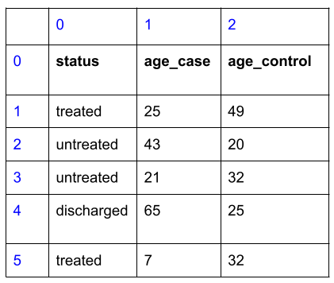
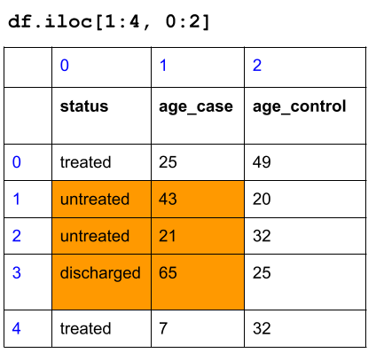

```{r, include = FALSE}
ottrpal::set_knitr_image_path()
```

# Working with data structures

In our second lesson, we start to look at two **data structures**, **Lists** and **Dataframes**, that can handle a large amount of data for analysis.

## Lists

In the first exercise, you started to explore **data structures**, which store information about data types. You explored **lists**, which is an ordered collection of data types or data structures. Each *element* of a list contains a data type or another data structure.

We can now store a vast amount of information in a list, and assign it to a single variable. Even more, we can use operations and functions on a list, modifying many elements within the list at once! This makes analyzing data much more scalable and less repetitive.

We create a list via the bracket `[ ]` operation.

```{python}
staff = ["chris", "ted", "jeff"]
chrNum = [2, 3, 1, 2, 2]
mixedList = [False, False, False, "A", "B", 92]
```

### Subsetting lists

To access an element of a list, you can use the bracket notation `[ ]` to access the elements of the list. We simply access an element via the "index" number - the location of the data within the list.

*Here's the tricky thing about the index number: it starts at 0!*

1st element of `chrNum`: `chrNum[0]`

2nd element of `chrNum`: `chrNum[1]`

...

5th element of `chrNum`: `chrNum[4]`

With subsetting, you can modify elements of a list or use the element of a list as part of an expression.

### Subsetting multiple elements of lists

Suppose you want to access multiple elements of a list, such as accessing the first three elements of `chrNum`. You would use the **slice** operator `:`, which specifies:

-   the index number to start

-   the index number to stop, *plus one.*

If you want to access the first three elements of `chrNum`:

```{python}
chrNum[0:3]
```

The first element's index number is 0, the third element's index number is 2, plus 1, which is 3.

If you want to access the second and third elements of `chrNum`:

```{python}
chrNum[1:3]
```

If you want to access everything but the first three elements of `chrNum`:

```{python}
chrNum[3:]
```

Here, the stop index number was not specificed. When the start or stop index is *not* specified, it implies that you are subsetting starting the from the beginning of the list or subsetting to the end of the list, respectively:

```{python}
chrNum[:3]
chrNum[3:]
```

There are other popular uses of the slice operator `:`, such as negative indicies to count from the end of a list, or subsetting with a fixed increment. You can find more discussion of list slicing [here](https://wesmckinney.com/book/python-builtin#list_slicing).

## Objects in Python

The list data structure has an organization and functionality that metaphorically represents a pen-and-paper list in our physical world. Like a physical object, we have examined:

-   What does it contain (in terms of data)?

-   What can it do (in terms of operations and functions)?

And if it "makes sense" to us, then it is well-designed.

The list data structure we have been working with is an example of an **Object**. The definition of an object allows us to ask the questions above: *what does it contain, and what can it do?* It is an organizational tool for a collection of data and functions that we can relate to, like a physical object. Formally, an object contains the following:

-   **Value** that holds the essential data for the object.

-   **Attributes** that store additional data for the object.

-   Functions called **Methods** that can be used on the object.

This organizing structure on an object applies to pretty much all Python data types and data structures.

Let's see how this applies to the list:

-   **Value**: the contents of the list, such as `[2, 3, 4].`

-   **Attributes** that store additional values: Not relevant for lists.

-   **Methods** that can be used on the object: `chrNum.count(2)` counts the number of instances 2 appears as an element of `chrNum`.

Object methods are functions that does something with the object you are using it on. You should think about `chrNum.count(2)` as a function that takes in `chrNum` and `2` as inputs. If you want to use the count function on list `mixedList`, you would use `mixedList.count(x)`.

Here are some more examples of methods with lists:

| Function method                                                              | What it takes in             | What it does                                                          | Returns                          |
|---------------|---------------|---------------------------|---------------|
| [`chrNum.count(x)`](https://docs.python.org/3/tutorial/datastructures.html)  | list `chrNum`, data type `x` | Counts the number of instances `x` appears as an element of `chrNum`. | Integer                          |
| [`chrNum.append(x)`](https://docs.python.org/3/tutorial/datastructures.html) | list `chrNum`, data type `x` | Appends `x` to the end of the `chrNum`.                               | None (but `chrNum` is modified!) |
| [`chrNum.sort()`](https://docs.python.org/3/tutorial/datastructures.html)    | list `chrNum`                | Sorts `chrNum` by ascending order.                                    | None (but `chrNum` is modified!) |
| [`chrNum.reverse()`](https://docs.python.org/3/tutorial/datastructures.html) | list `chrNum`                | Reverses the order of `chrNum`.                                       | None (but `chrNum` is modified!) |

## Dataframes

A Dataframe is a two-dimensional data structure that stores data like a spreadsheet does.

The Dataframe data structure is found within a Python module called "Pandas". A Python module is an organized collection of functions and data structures. The `import` statement below gives us permission to access the "Pandas" module via the variable `pd`.

To load in a Dataframe from existing spreadsheet data, we use the function [`pd.read_csv()`](https://pandas.pydata.org/docs/reference/api/pandas.read_csv.html):

```{python}
import pandas as pd

metadata = pd.read_csv("classroom_data/metadata.csv")
type(metadata)
```

There is a similar function [`pd.read_excel()`](https://pandas.pydata.org/docs/reference/api/pandas.read_excel.html) for loading in Excel spreadsheets.

Let's investigate the Dataframe as an object:

-   What does a Dataframe contain (in terms of data)?

-   What can a Dataframe do (in terms of operations and functions)?

### What does a Dataframe contain (in terms of data)?

We first take a look at the contents:

```{python}
metadata
```

It looks like there are 1864 rows and 30 columns in this Dataframe, and when we display it it shows some of the data.

We can look at specific columns by looking at **attributes** via the dot operation. We can also look at the columns via the bracket operation.

```{python}
metadata.ModelID
metadata['ModelID']
```

The names of all columns is stored as an attribute, which can be accessed via the dot operation.

```{python}
metadata.columns
```

The number of rows and columns are also stored as an attribute:

```{python}
metadata.shape
```

### What can a Dataframe do (in terms of operations and functions)?

We can use the [`.head()`](https://pandas.pydata.org/pandas-docs/stable/reference/api/pandas.DataFrame.head.html) and [`.tail()`](https://pandas.pydata.org/pandas-docs/stable/reference/api/pandas.DataFrame.tail.html) methods to look at the first few rows and last few rows of `metadata`, respectively:

```{python}
metadata.head()
metadata.tail()
```

Both of these functions (without input arguments) are considered as **methods**: they are functions that does something with the Dataframe you are using it on. You should think about `metadata.head()` as a function that takes in `metadata` as an input. If we had another Dataframe called `my_data` and you want to use the same function, you will have to say `my_data.head()`.

#### Subsetting Dataframes

Perhaps the most important operation you will can do with Dataframes is subsetting them. There are two ways to do it. The first way is to subset by numerical indicies, exactly like how we did for lists.

You will use the [`iloc`](https://pandas.pydata.org/pandas-docs/stable/reference/api/pandas.DataFrame.iloc.html) and bracket operations, and you give two slices: one for the row, and one for the column.

Let's start with a small dataframe to see how it works before returning to `metadata`:

```{python}
df = pd.DataFrame(data={'status': ["treated", "untreated", "untreated", "discharged", "treated"],
                            'age_case': [25, 43, 21, 65, 7],
                            'age_control': [49, 20, 32, 25, 32]})
df
```

Here is how the dataframe looks like with the row and column index numbers:



Subset the second to fourth rows, and the first two columns:



Now, back to `metadata` dataframe:

Subset the first 5 rows, and first two columns:

```{python}
metadata.iloc[:5, :2]
```

If we want a custom slice that is not sequential, we can use an integer list. Subset the last 5 rows, and the 1st and 10 and 21th column:

```{python}
metadata.iloc[5:, [1, 10, 21]]
```

When we subset via numerical indicies, it's called **explicit subsetting**. This is a great way to start thinking about subsetting your dataframes for analysis, but explicit subsetting can lead to some inconsistencies in the long run. For instance, suppose your collaborator added a new cell line to the metadata and changed the order of the column. Then your code to subset the last 5 rows and the columns will get you a different answer once the spreadsheet is changed.

The second way is to subset by the column name and comparison operators, also known as **implicit subsetting**. This is much more robust in data analysis practice. You will learn about it next week!

## Exercises

Exercise for week 2 can be found [here](https://colab.research.google.com/drive/1oIL3gKEZR2Lq16k6XY0HXIhjYl34pEjr?usp=sharing).
