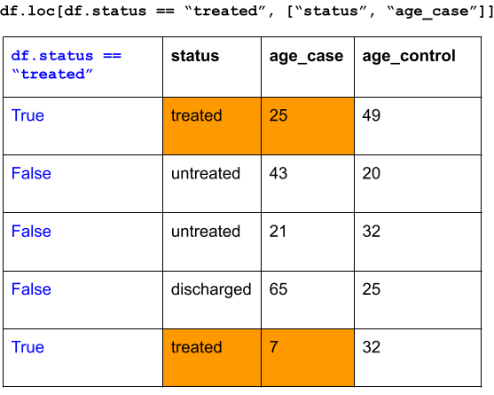

```{r, include = FALSE}
ottrpal::set_knitr_image_path()
```

# Data Wrangling, Part 1

From our first two lessons, we are now equipped with enough fundamental programming skills to apply it to various steps in the data science workflow, which is a natural cycle that occurs in data analysis.

{width="550"}

For the rest of the course, we focus on *Transform* and *Visualize* with the assumption that our data is in a nice, "Tidy format". First, we need to understand what it means for a data to be "Tidy".

## Tidy Data

Here, we describe a standard of organizing data. It is important to have standards, as it facilitates a consistent way of thinking about data organization and building tools (functions) that make use of that standard. The principles of **tidy data**, developed by Hadley Wickham:

1.  Each variable must have its own column.

2.  Each observation must have its own row.

3.  Each value must have its own cell.

If you want to be technical about what variables and observations are, Hadley Wickham describes:

> A **variable** contains all values that measure the same underlying attribute (like height, temperature, duration) across units. An **observation** contains all values measured on the same unit (like a person, or a day, or a race) across attributes.

{width="800"}

## Our working Tidy Data: DepMap Project

The [Dependency Map project](https://depmap.org/portal/) is a multi-omics profiling of cancer cell lines combined with functional assays such as CRISPR and drug sensitivity to help identify cancer vulnerabilities and drug targets. Here are some of the data that we have public access to. We have been looking at the metadata since last session.

-   Metadata

-   Somatic mutations

-   Gene expression

-   Drug sensitivity

-   CRISPR knockout

-   and more...

Let's load these datasets in, and see how these datasets fit the definition of Tidy data:

```{python}
import pandas as pd

metadata = pd.read_csv("classroom_data/metadata.csv")
mutation = pd.read_csv("classroom_data/mutation.csv")
expression = pd.read_csv("classroom_data/expression.csv")
```

```{python}
metadata.head()
```

```{python}
mutation.head()
```

```{python}
expression.head()
```

| Dataframe  | The observation is | Some variables are            | Some values are             |
|------------|--------------------|-------------------------------|-----------------------------|
| metadata   | Cell line          | ModelID, Age, OncotreeLineage | "ACH-000001", 60, "Myeloid" |
| expression | Cell line          | KRAS_Exp                      | 2.4, .3                     |
| mutation   | Cell line          | KRAS_Mut                      | TRUE, FALSE                 |

## Transform: "What do you want to do with this Dataframe"?

Remember that a major theme of the course is about: **How we organize ideas \<-\> Instructing a computer to do something.**

Until now, we haven't focused too much on how we organize our scientific ideas to interact with what we can do with code. Let's pivot to write our code driven by our scientific curiosity. After we are sure that we are working with Tidy data, we can ponder how we want to transform our data that satisfies our scientific question. We will look at several ways we can transform Tidy data, starting with subsetting columns and rows.

Here's a starting prompt:

> In the `metadata` dataframe, which rows would you subset for and columns would you subset for that relate to a scientific question?

We have been using **explicit subsetting** with numerical indicies, such as "I want to filter for rows 20-50 and select columns 2 and 8". We are now going to switch to **implicit subsetting** in which we describe the subsetting criteria via comparision operators and column names, such as:

*"I want to subset for rows such that the OncotreeLineage is lung cancer and subset for columns Age and Sex."*

Notice that when we subset for rows in an implicit way, we formulate our criteria in terms of the columns. This is because we are guaranteed to have column names in Dataframes, but not row names.

#### Let's convert our implicit subsetting criteria into code!

To subset for rows implicitly, we will use the conditional operators on Dataframe columns you used in Exercise 2. To formulate a conditional operator expression that OncotreeLineage is breast cancer:

```{python}
metadata['OncotreeLineage'] == "Lung"
```

Then, we will use the [`.loc`](https://pandas.pydata.org/docs/reference/api/pandas.DataFrame.loc.html) attribute (which is different than [`.iloc`](https://pandas.pydata.org/docs/reference/api/pandas.DataFrame.iloc.html) attribute!) and subsetting brackets to subset rows and columns Age and Sex at the same time:

```{python}
metadata.loc[metadata['OncotreeLineage'] == "Lung", ["Age", "Sex"]]
```

What's going on here? The first component of the subset, `metadata['OncotreeLineage'] == "Lung"`, subsets for the rows. It gives us a column of `True` and `False` values, and we keep rows that correspond to `True` values. Then, we specify the column names we want to subset for via a list.

Here's another example:

```{python}
df = pd.DataFrame(data={'status': ["treated", "untreated", "untreated", "discharged", "treated"],
                            'age_case': [25, 43, 21, 65, 7],
                            'age_control': [49, 20, 32, 25, 32]})
                            
df
```

*"I want to subset for rows such that the status is"treated" and subset for columns status and age_case."*

```{python}
df.loc[df.status == "treated", ["status", "age_case"]]
```



## Summary Statistics

Now that your Dataframe has be transformed based on your scientific question, you can start doing some analysis on it! A common data science task is to examine summary statistics of a dataset, which summarizes the all the values from a variable in a numeric summary, such as mean, median, or mode.

If we look at the data structure of a Dataframe's column, it is actually not a List, but an object called Series. It has methods can compute summary statistics for us. Let's take a look at a few popular examples:

| Function method                                                                                                           | What it takes in                              | What it does                                                                  | Returns       |
|---------------------------------------------------------------------------------------------------------------------------|-----------------------------------------------|-------------------------------------------------------------------------------|---------------|
| [`metadata.Age.mean()`](https://pandas.pydata.org/docs/reference/api/pandas.Series.mean.html)                             | `metadata.Age` as a numeric Series            | Computes the mean value of the `Age` column.                                  | Float (NumPy) |
| [`metadata['Age'].median()`](https://pandas.pydata.org/docs/reference/api/pandas.Series.median.html)                      | `metadata['Age']` as a numeric Series         | Computes the median value of the `Age` column.                                | Float (NumPy) |
| [`metadata.Age.max()`](https://pandas.pydata.org/docs/reference/api/pandas.Series.max.html)                               | `metadata.Age` as a numeric Series            | Computes the max value of the `Age` column.                                   | Float (NumPy) |
| [`metadata.OncotreeSubtype.value_counts()`](https://pandas.pydata.org/docs/reference/api/pandas.Series.value_counts.html) | `metadata.OncotreeSubtype` as a string Series | Creates a frequency table of all unique elements in `OncotreeSubtype` column. | Series        |

Let's try it out, with some nice print formatting:

```{python}
print("Mean value of Age column:", metadata['Age'].mean())
print("Frequency of column", metadata.OncotreeLineage.value_counts())
```

Notice that the output of some of these methods are Float (NumPy). This refers to a Python Object called NumPy that is extremely popular for scientific computing, but we're not focused on that in this course.)

## Simple data visualization

We will dedicate extensive time later this course to talk about data visualization, but the Dataframe's column, Series, has a method called [`.plot()`](https://pandas.pydata.org/docs/reference/api/pandas.Series.plot.html) that can help us make simple plots for one variable. The `.plot()` method will by default make a line plot, but it is not necessary the plot style we want, so we can give the optional argument `kind` a String value to specify the plot style. We use it for making a histogram or bar plot.

| Plot style | Useful for | kind = | Code                                                         |
|------------|------------|--------|--------------------------------------------------------------|
| Histogram  | Numerics   | "hist" | `metadata.Age.plot(kind = "hist")`                           |
| Bar plot   | Strings    | "bar"  | `metadata.OncotreeSubtype.value_counts().plot(kind = "bar")` |

Let's look at a histogram:

```{python}
import matplotlib.pyplot as plt

plt.figure()
metadata.Age.plot(kind = "hist")
plt.show()
```

Let's look at a bar plot:

```{python}
plt.figure()
metadata.OncotreeLineage.value_counts().plot(kind = "bar")
plt.show()
```

(The `plt.figure()` and `plt.show()` functions are used to render the plots on the website, but you don't need to use it for your exercises. We will discuss this in more detail during our week of data visualization.)

#### Chained function calls

Let's look at our bar plot syntax more carefully. We start with the column `metadata.OncotreeLineage`, and then we first use the method `.value_counts()` to get a *Series* of a frequency table. Then, we take the frequency table Series and use the `.plot()` method.

It is quite common in Python to have multiple "chained" function calls, in which the output of `.value_counts()` is used for the input of `.plot()` all in one line of code. It takes a bit of time to get used to this!

Here's another example of a chained function call, which looks quite complex, but let's break it down:

```{python}
plt.figure()

metadata.loc[metadata.AgeCategory == "Adult", ].OncotreeLineage.value_counts().plot(kind="bar")

plt.show()

```

1.  We first take the entire `metadata` and do some subsetting, which outputs a Dataframe.
2.  We access the `OncotreeLineage` column, which outputs a Series.
3.  We use the method `.value_counts()`, which outputs a Series.
4.  We make a plot out of it!

We could have, alternatively, done this in several lines of code:

```{python}
plt.figure()

metadata_subset = metadata.loc[metadata.AgeCategory == "Adult", ]
metadata_subset_lineage = metadata_subset.OncotreeLineage
lineage_freq = metadata_subset_lineage.value_counts()
lineage_freq.plot(kind = "bar")

plt.show()
```

These are two different *styles* of code, but they do the exact same thing. It's up to you to decide what is easier for you to understand.

## Exercises

Exercise for week 3 can be found [here](https://colab.research.google.com/drive/1ClNOJviyrcaaoVq5F-YtsO7NhMqn315c?usp=sharing).
