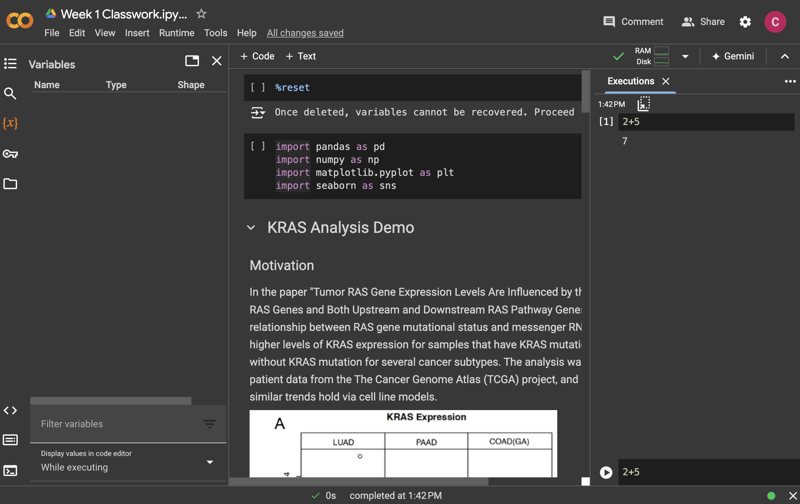

# Intro to Computing

Welcome to Introduction to Python! Each week, we cover a chapter, which consists of a lesson and exercise. In our first week together, we will look at big conceptual themes in programming, see how code is run, and learn some basic grammar structures of programming.

## Goals of the course

In the next 6 weeks, we will explore:

-   Fundamental concepts in high-level programming languages (Python, R, Julia, etc.) that is transferable: *How do programs run, and how do we solve problems using functions and data structures?*

-   Beginning of data science fundamentals: *How do you translate your scientific question to a data wrangling problem and answer it?*

    .](https://d33wubrfki0l68.cloudfront.net/571b056757d68e6df81a3e3853f54d3c76ad6efc/32d37/diagrams/data-science.png){width="450"}

-   Find a nice balance between the two throughout the course: we will try to reproduce a figure from a scientific publication using new data.

## What is a computer program?

-   A sequence of instructions to manipulate data for the computer to execute.

-   A series of translations: English \<-\> Programming Code for Interpreter \<-\> Machine Code for Central Processing Unit (CPU)

We will focus on English \<-\> Programming Code for Python Interpreter in this class.

More importantly: **How we organize ideas \<-\> Instructing a computer to do something**.

## A programming language has following elements: {#a-programming-language-has-following-elements}

-   Grammar structure to construct expressions; combining expressions to create more complex expressions

-   Encapsulate complex expressions via **functions** to create modular and reusable tasks

-   Encapsulate complex data via **data structures** to allow efficient manipulation of data

## Google Colab Setup

Google Colab is a Integrated Development Environment (IDE) on a web browser. Think about it as Microsoft Word to a plain text editor. It provides extra bells and whistles to using Python that is easier for the user.

Let's open up the KRAS analysis in Google Colab. If you are taking this course while it is in session, the project name is probably named "KRAS Demo" in your Google Classroom workspace. If you are taking this course on your own time, you can view it [here](https://colab.research.google.com/drive/1_77QQcj0mgZOWLlhtkZ-QKWUP1dnSt-_?usp=sharing).

{width="800"}

Today, we will pay close attention to:

-   Python Console ("Executions"): Open it via View -\> Executed code history. You give it one line of Python code, and the console executes that single line of code; you give it a single piece of instruction, and it executes it for you.

-   Notebook: in the central panel of the website, you will see Python code interspersed with word document text. This is called a Python Notebook (other similar services include Jupyter Notebook, iPython Notebook), which has chunks of plain text *and* Python code, and it helps us understand better the code we are writing.

-   Variable Environment: Open it by clicking on the "{x}" button on the left-hand panel. Often, your code will store information in the Variable Environment, so that information can be reused. For instance, we often load in data and store it in the Variable Environment, and use it throughout rest of your Python code.

The first thing we will do is see the different ways we can run Python code. You can do the following:

1.  Type something into the Python Console (Execution) and click the arrow button, such as `2+2`. The Python Console will run it and give you an output.
2.  Look through the Python Notebook, and when you see a chunk of Python Code, click the arrow button. It will copy the Python code chunk to the Python Console and run all of it. You will likely see variables created in the Variables panel as you load in and manipulate data.
3.  Run every single Python code chunk via Runtime -\> Run all.

Remember that the *order* that you run your code matters in programming. Your final product would be the result of Option 3, in which you run every Python code chunk from start to finish. However, sometimes it is nice to try out smaller parts of your code via Options 1 or 2. But you will be at risk of running your code out of order!

To create your own content in the notebook, click on a section you want to insert content, and then click on "+ Code" or "+ Text" to add Python code or text, respectively.

Python Notebook is great for data science work, because:

-   It encourages reproducible data analysis, when you run your analysis from start to finish.

-   It encourages excellent documentation, as you can have code, output from code, and prose combined together.

-   It is flexible to use other programming languages, such as R.

Now, we will get to the basics of programming grammar.

## Grammar Structure 1: Evaluation of Expressions

-   **Expressions** are be built out of **operations** or **functions**.

-   Functions and operations take in **data types**, do something with them, and return another data type.

-   We can combine multiple expressions together to form more complex expressions: an expression can have other expressions nested inside it.

For instance, consider the following expressions entered to the Python Console:


``` python
18 + 21
```

```
## 39
```

``` python
max(18, 21)
```

```
## 21
```

``` python
max(18 + 21, 65)
```

```
## 65
```

``` python
18 + (21 + 65)
```

```
## 104
```

``` python
len("ATCG")
```

```
## 4
```

Here, our input **data types** to the operation are **integer** in lines 1-4 and our input data type to the function is **string** in line 5. We will go over common data types shortly.

Operations are just functions in hiding. We could have written:


``` python
from operator import add

add(18, 21)
```

```
## 39
```

``` python
add(18, add(21, 65))
```

```
## 104
```

Remember that the Python language is supposed to help us understand what we are writing in code easily, lending to *readable* code. Therefore, it is sometimes useful to come up with operations that is easier to read. (Most functions in Python are stored in a collection of functions called **modules** that needs to be loaded. The `import` statement gives us permission to access the functions in the module "operator".)

### Data types

Here are some common data types we will be using in this course.

| Data type name | **Data type shorthand** |      **Examples**       |
|----------------|:-----------------------:|:-----------------------:|
| Integer        |           int           |          2, 4           |
| Float          |          float          |      3.5, -34.1009      |
| String         |           str           | "hello", "234-234-8594" |
| Boolean        |          bool           |       True, False       |

### Function machine schema

A nice way to summarize this first grammar structure is using the function machine schema, way back from algebra class:


Here are some aspects of this schema to pay attention to:

-   A programmer should not need to know how the function or operation is implemented in order to use it - this emphasizes abstraction and modular thinking, a foundation in any programming language.

-   A function can have different kinds of inputs and outputs - it doesn't need to be numbers. In the `len()` function, the input is a String, and the output is an Integer. We will see increasingly complex functions with all sorts of different inputs and outputs.

## Grammar Structure 2: Storing data types in the Variable Environment

To build up a computer program, we need to store our returned data type from our expression somewhere for downstream use. We can assign a variable to it as follows:


``` python
x = 18 + 21
```

If you enter this in the Console, you will see that in the Variable Environment, the variable `x` has a value of `39`.

### Execution rule for variable assignment

> Evaluate the expression to the right of `=`.
>
> Bind variable to the left of `=` to the resulting value.
>
> The variable is stored in the **Variable Environment**.

The Variable Environment is where all the variables are stored, and can be used for an expression anytime once it is defined. Only one unique variable name can be defined.

The variable is stored in the working memory of your computer, Random Access Memory (RAM). This is temporary memory storage on the computer that can be accessed quickly. Typically a personal computer has 8, 16, 32 Gigabytes of RAM.

Look, now `x` can be reused downstream:


``` python
x - 2
```

```
## 37
```

``` python
y = x * 2
```

It is quite common for programmers to not know what data type a variable is while they are coding. To learn about the data type of a variable, use the `type()` function on any variable in Python:


``` python
type(y)
```

```
## <class 'int'>
```

We should give useful variable names so that we know what to expect! If you are working with sales data, consider `num_sales` instead of `y`.

## Grammar Structure 3: Evaluation of Functions

Let's look at functions a little bit more formally: A function has a **function name**, **arguments**, and **returns** a data type.

### Execution rule for functions:

> Evaluate the function by its arguments if there's any, and if the arguments are functions or contains operations, evaluate those functions or operations first.
>
> The output of functions is called the **returned value**.

Often, we will use multiple functions in a nested way, and it is important to understand how the Python console understand the order of operation. We can also use paranthesis to change the order of operation. Think about what the Python is going to do step-by--step in the lines of code below:


``` python
max(len("hello"), 4)
```

```
## 5
```

``` python
(len("pumpkin") - 8) * 2
```

```
## -2
```

If we don't know how to use a function, such as `pow()`, we can ask for help:

```         
?pow

pow(base, exp, mod=None)
Equivalent to base**exp with 2 arguments or base**exp % mod with 3 arguments
 
Some types, such as ints, are able to use a more efficient algorithm when
invoked using the three argument form.
```

This shows the function takes in three input arguments: `base`, `exp`, and `mod=None`. When an argument has an assigned value of `mod=None`, that means the input argument already has a value, and you don't need to specify anything, unless you want to.

The following ways are equivalent ways of using the `pow()` function:


``` python
pow(2, 3)
```

```
## 8
```

``` python
pow(base=2, exp=3)
```

```
## 8
```

``` python
pow(exp=3, base=2)
```

```
## 8
```

but this will give you something different:


``` python
pow(3, 2)
```

```
## 9
```

And there is an operational equivalent:


``` python
2 ** 3
```

```
## 8
```

We will mostly look at functions with input arguments and return types in this course, but not all functions need to have input arguments and output return. Here are some varieties of functions to stretch your horizons.

| Function call    | What it takes in         | What it does                                | Returns |
|---------------|---------------|----------------------------|---------------|
| `pow(a, b)`      | integer `a`, integer `b` | Raises `a` to the `b`th power.              | Integer |
| `print(x)`       | any data type `x`        | Prints out the value of `x` to the console. | None    |
| `datetime.now()` | Nothing                  | Gets the current time.                      | String  |

## Tips on writing your first code

`Computer = powerful + stupid`

Computers are excellent at doing something specific over and over again, but is extremely rigid and lack flexibility. Here are some tips that is helpful for beginners:

-   Write incrementally, test often

-   Check your assumptions, especially using new functions, operations, and new data types.

-   Live environments are great for testing, but not great for reproducibility.

-   Ask for help!

To get more familiar with the errors Python gives you, take a look at this [summary of Python error messages](https://betterstack.com/community/guides/scaling-python/python-errors/).

## Exercises

Exercise for week 1 can be found [here](https://colab.research.google.com/drive/1AqVvktGz3LStUyu6dLJFsU2KoqNxgagT?usp=sharing).
