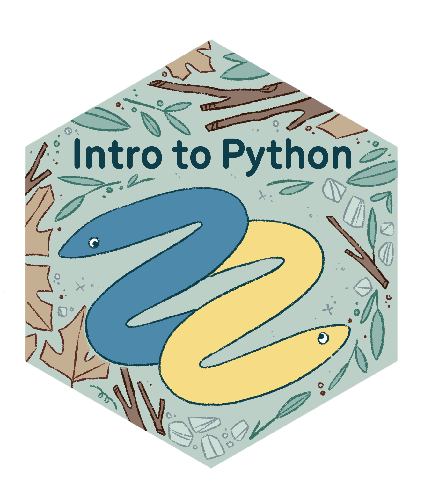
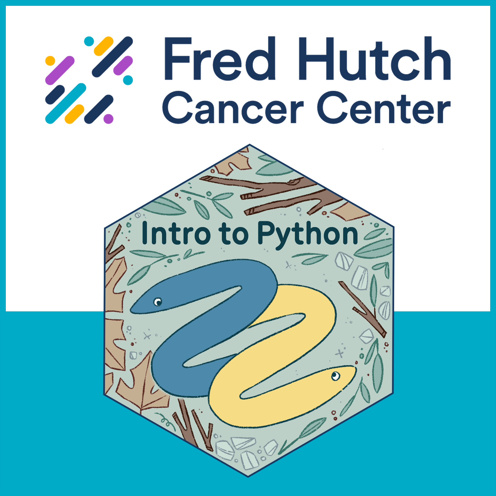
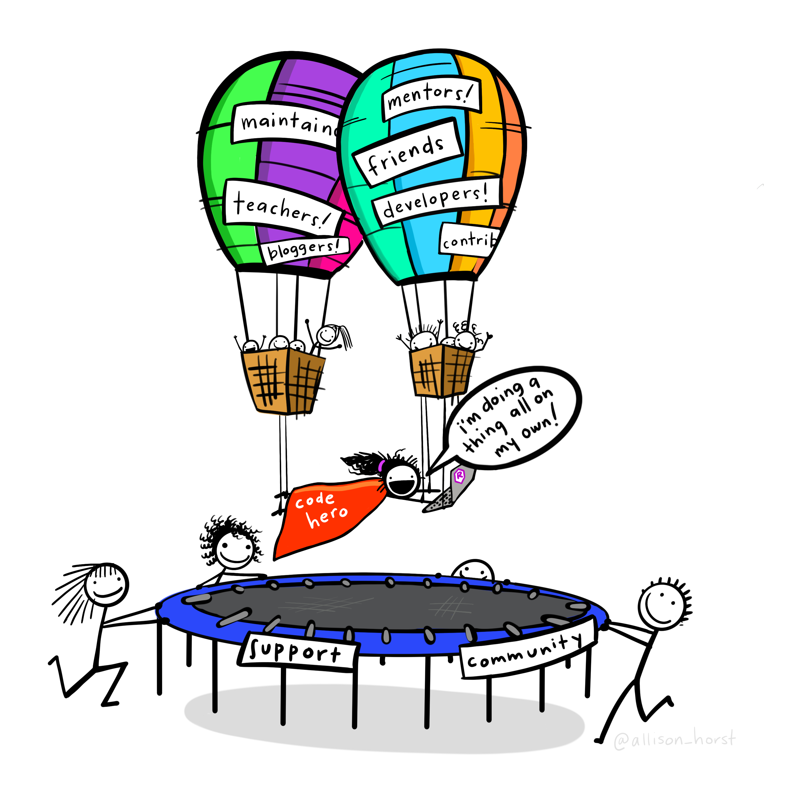



## Welcome!

{width="600"}

Please sign up for Google Classroom ([link](https://classroom.google.com/c/NzY0OTY2Nzc0NzU5?cjc=wpplaqbt)) if you haven't already.

## Course Logistics {.incremental}

- Hybrid course - recordings will be available online
    - In person: snacks/drinks will be available
- Slides are online and will be available before class
- Sign into Teams, even in person
- I am here in person every two weeks (see course contents)

## Course Logistics {.incremental}

- I will communicate with you before and after class via email
- Ask questions via Teams chat
- Office hour (11:30-12 PM) before each class
    - Will send out invite
- We will be taking collective notes in this [Course Cheatsheet](https://docs.google.com/document/d/1b98V6-rxh1LXIMb7bKnr2VBbQHv4Cu9KHfK2CB6Tfls/edit?usp=sharing)
    - I will mirror announcements there as well

## Introductions

-   Who am I?

. . .

-   What is [DaSL](https://hutchdatascience.org/)?

. . .

-   Who are you?

    -   Name, pronouns, group you work in

    -   What you want to get out of the class

    -   What is your favorite fall activity?

. . .

-   Our wonderful TA - Scott Chamberlain!


## Goals of the course

. . .

-   Fundamental concepts in programming languages: *How do programs run, and how do we solve problems effectively using functions and data structures?*

. . .

-   Data science fundamentals: *How do you translate your scientific question to a data wrangling problem and answer it?*

    {width="550"}


## Content of the course

|Week|Date|Topic|
|----|-----|----|
|1.*|9/23|Intro to Computing|
|2.|9/30| Data structures|
|3.*|10/7|Data wrangling 1|
|4.|10/14| Data wrangling 2|
|5.*|10/21|Data visualization|
|No Class|10/28|Accelerator Retreat|
|6.*|11/4|Wrap-up|

* = Ted on-campus

## Culture of the course

. . .

-   Challenge: We are learning a new language, but you already have a full-time job

. . .

-   *Teach not for mastery, but teach for empowerment to learn effectively.*

. . .

-   *Teach at learner's pace.*

## Culture of the course

-   Challenge: We sometimes struggle with our data science in isolation, unaware that someone two doors down from us has worked on something similar.

. . .

-   *We learn and work better with our peers.*

. . .

-   *We encourage discussion and questions. If you have a question, others probably have it. Asking question is a way of taking care of others in class.*

. . .

- *If possible, find a buddy to work with. Trade ideas back and forth*

## Learning can be hard


- Be patient with yourself, it's not you
- Sometimes things are inherently difficult
- Take a break, do something else, come back to it.

## Getting Help

- We will be here 1/2 hour early (11:30) for office hours
    - Come work on exercises
- Learning Community is also a good time
- Make an appointment with me (link in my email signature)

## Badge of completion

{width="350"}

We offer a [badge of completion](https://www.credly.com/org/fred-hutch/badge/intro-to-python) when you finish the course!

What it is:

-   A display of what you accomplished in the course, shareable in your professional networks such as LinkedIn, similar to online education services such as Coursera.

What it isn't:

-   Accreditation through an university or degree-granting program.

. . .

Requirements:

-   Complete badge-required sections of the exercises for 4 out of 5 assignments.

## Badge of Completion

- I will be pretty easy in terms of "grading" badge assignments
- Let me know when you're finished and I will look over your exercises
- There will be a completion dashboard
- Late assignments are fine, but I encourage you to not take advantage of that.

## Break (5 mins)

A pre-course survey:

<https://forms.gle/K4sQ3KNDPVp6NZTu7>

## Ready?




## What is a computer program?

. . .

-   A *sequence* of instructions to manipulate data for the computer to execute.

. . .

-   A series of *translations*: English \<-\> Programming Code for Interpreter \<-\> Machine Code

. . .

We will focus on English \<-\> Programming Code for Python Interpreter in this class.

## Grammar Structure 1: Evaluation of Expressions

Consider the expression:

```{pyodide}
min(2, 10)
```

. . .

-   **Expressions** are built out of **functions** or **operations**.

. . .

-   Functions and operations take in **data types** as inputs, and **return** another data type as output.

. . .

-   If the function or operation input contains expressions, evaluate those expressions first.

## Examples

```{pyodide}
18 + 21
```

. . .

```{pyodide}
max(18, 21)
```

. . .

```{pyodide}
max(18 + 21, 65)
```

. . .

```{pyodide}
18 + (21 + 65)
```

. . .

```{pyodide}
len("ATCG")
```

## Interpreting functions

{alt="Function machine from algebra class." width="200"}

-   To use a function, we only need to know what the expected inputs and outputs are. The inner workings don't matter yet.

. . .

-   A function can have different kinds of inputs and outputs - it doesn't need to be numbers.

## Data types

| Data type name | **Data type shorthand** |      **Examples**       |
|----------------|:-----------------------:|:-----------------------:|
| Integer        |           int           |          2, 4           |
| Float          |          float          |      3.5, -34.1009      |
| String         |           str           | "hello", "234-234-8594" |
| Boolean        |          bool           |       True, False       |

## Grammar Structure 2: Storing variables in the environment

. . .

To build up a computer program, we need to store our returned data type from our expression somewhere for downstream use.

```{pyodide}
age = 18 + 21
```

. . .

Evaluate the expression to the right of `=`.

Bind variable on the left of `=` to the resulting value.

Then the variable is stored in the **environment**.

## Looking at a variable

You can always look at the value of a variable by typing the name

```{pyodide}
age
```

## Downstream

Look, now `age` can be reused downstream:

```{pyodide}
age - 2
```

. . .

```{pyodide}
age_double = age * 2
age_double
```

. . .

What's the data type of a variable?

```{pyodide}
type(age_double)
```

## More practice

-   `max(a, b, ...)` takes in at least two numeric input arguments, and returns the highest value.

-   `pow(base, exp)` takes in two Integer input arguments, and returns the `base` raised to the `exp` power.

. . .

```{pyodide}
(len("hello") + 4) * pow(2, 3)
```

## Another Example

```{pyodide}
brothers_age = 45
grandmas_age = 90
cousins_age = 32
age = max(cousins_age, brothers_age, grandmas_age)
secret = (len("hello") + age) * pow(2, 3)
secret
```

## Lists

**List** is a **data structure** that stores many elements of various data type, and the order its elements are stored matters.

You can create a List via the bracket \`\[ \]\` operator:

```{pyodide}
chrs = [2, 3, 2, 1, 2]
```

. . .

Then, you can access the elements of a list via its "index number", starting at 0.

```{pyodide}
chrs[0]
```

. . .

```{pyodide}
chrs[1]
```

## Setting up Google Classroom and Colab and trying out your first analysis!

-   Google Classroom invite: <https://classroom.google.com/c/NzY0OTY2Nzc0NzU5?cjc=wpplaqbt>

-   Classwork -\> Week 1 Classwork -\> `Week 1 Classwork.ipynb`

    -   Alternative link [here](https://colab.research.google.com/drive/1_77QQcj0mgZOWLlhtkZ-QKWUP1dnSt-_?authuser=1#scrollTo=vSuAhvp2Aa33).


## Tips on writing your first code

. . .

`Computer = powerful + stupid`

. . .

-   Write incrementally: if `function(a, b + c)` isn't working, examine `a` and `b + c`

. . .

-   The sequence of instructions you give matters! Refresh the page to clear the environment.

. . .

-   **Ask for help!**
