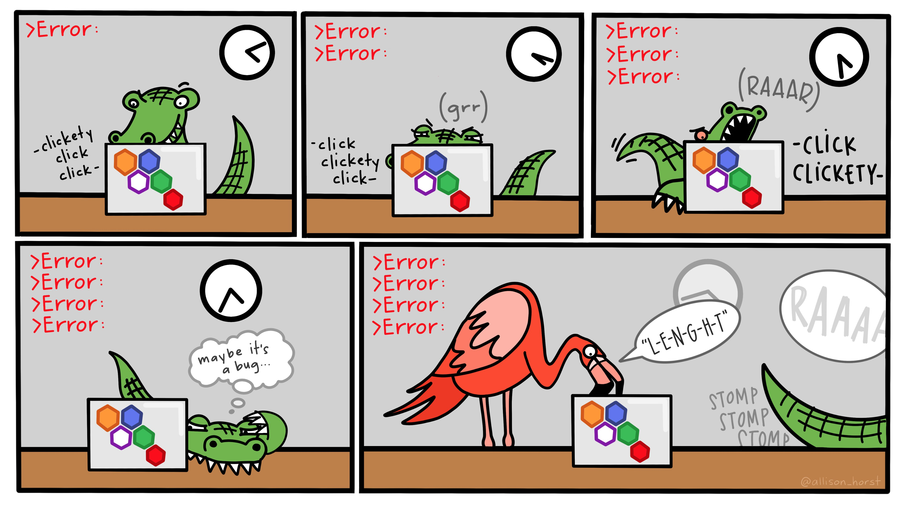
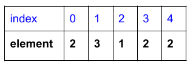

## Solving problems...



. . .

What is a problem you encountered and fixed recently?

## [Exercise 1 Continued](https://colab.research.google.com/drive/1Oypt0HeVqmzBQcsIuixpoAm6syE-kwXy?usp=sharing)

-   Three styles of defining and updating variables

## Lists

**List** is a **data structure** that stores many elements of various data types, and the order matters.

. . .

You can create a List via the bracket `[ ]` operator:

```{python}
staff = ["chris", "ted", "jeff"]
chrNum = [2, 3, 1, 2, 2]
mixedList = [False, False, False, "A", "B", 92]
```

. . .

How long is a list?

```{python}
len(staff)
```

## Subset to an element of a list

You can access the elements of a list via its "index number", starting at 0.

{width="200"}

```{python}
chrNum[0]
```

. . .

```{python}
chrNum[2]
```

. . .

Let the fifth element of `chrNum` be the sum of first and second element of `chrNum`:

. . .

```{python}
chrNum[4] = chrNum[0] + chrNum[1]
```

. . .

```{python}
chrNum
```

## Subsetting multiple elements of lists

Suppose you want to access the first three elements of `chrNum`.

```{python}
chrNum
```

. . .

You can use the **slice** operator `:` to specify,

```{python}
chrNum[:3]
```

. . .

The last three elements:

```{python}
chrNum[-3:]
```

. . .

The slice `:` represents the start or the end of the List. We also have negative indicies that help us count backwards.

. . .

Learn more about subsetting lists [in full complexity](https://towardsdatascience.com/mastering-indexing-and-slicing-in-python-443e23457125/).

## List Methods

**Methods** are functions for a specific data type, such as a list.

. . .

`chrNum.append(5)` is a method for lists with `chrNum` and 5 as inputs.

. . .

The method appends 5 to the list `chrNum`.

. . .

```{python}
chrNum = [2, 3, 1, 2, 2]
```

. . .

```{python}
chrNum.append(5)
```

. . .

```{python}
chrNum
```

. . .

Interesting, there's no output from this method, but `chrNum` has changed!

See appendix for examples of functions and methods that don't always have an input or output.

## Methods vs Functions

**Methods** are for a specific data type and *have to* take in the variable referenced as an input: `chrNum.count(2)` automatically treat `chrNum` as an input.

. . .

**Functions** do not have an implied input: `len(chrNum)` requires specifying a list in the input. Functions are less tied to a data type: `len("hello")` is appropriate for Strings.

. . .

Otherwise, no distinction between the two.

## Questions to ask a data structure

In a List, we have explored:

-   *What does it contain* (in terms of data)?

-   *What can it do* (in terms of methods)?

. . .

We will explore it in a similar way for Dataframes.

## Dataframes

A Dataframe is a two-dimensional data structure that is similar to a spreadsheet.

```{python}
import pandas as pd

metadata = pd.read_csv("../classroom_data/metadata.csv")
type(metadata)
```

. . .

Let's investigate the Dataframe:

-   *What does a Dataframe contain (data)?*

    -   the spreadsheet, columns, column names, shape, subsetting

-   *What can a Dataframe do?* *(methods)*

    -   `.head()`, `.tail()`

## What does a Dataframe contain (data)?

Columns

```{python}
metadata.ModelID
metadata['ModelID']
```

. . .

Column names

```{python}
metadata.columns
```

. . .

Shape

```{python}
metadata.shape
```

## Dataframe subsetting

Using [`iloc`](https://pandas.pydata.org/pandas-docs/stable/reference/api/pandas.DataFrame.iloc.html) and bracket operations, you give two slices: one for the row, and one for the column.

```{python}
df = pd.DataFrame(data={'status': ["treated", "untreated", "untreated", "discharged", "treated"],
                            'age_case': [25, 43, 21, 65, 7],
                            'age_control': [49, 20, 32, 25, 32]})
df
```

. . .

Subset to the first row, second column:

```{python}
df.iloc[0, 1]
```

. . .

Subset to the first 4 rows, second column:

```{python}
df.iloc[:4, 2]
```

. . .

Subset to the first 4 rows, first two columns:

```{python}
df.iloc[:4, :2]
```

## Dataframe subsetting

If we want a custom slice that is not sequential, we can use an integer list.

Subset the first 3 rows, and the 1st and 3rd column:

```{python}
df.iloc[:3, [0, 2]]
```

## How did class go for you today?

<https://forms.gle/qGTBHdDwXciYrPa39>

## Appendix: Functions and Methods examples

| Function call                                                                | What it takes in             | What it does                                                  | Returns                          |
|---------------------|-----------------|-----------------|-----------------|
| [`pow(a, b)`](https://docs.python.org/3/library/functions.html#pow)          | integer `a`, integer `b`     | Raises `a` to the `b`th power.                                | Integer                          |
| [`time.sleep(x)`](https://docs.python.org/3/library/time.html#time.sleep)    | Integer `x`                  | Waits for `x` seconds.                                        | None                             |
| [`dir()`](https://docs.python.org/3/library/functions.html#dir)              | Nothing                      | Gives a list of all the variables defined in the environment. | List                             |
| [`chrNum.append(x)`](https://docs.python.org/3/tutorial/datastructures.html) | list `chrNum`, data type `x` | Appends `x` to the end of the `chrNum`.                       | None (but `chrNum` is modified!) |
| [`chrNum.sort()`](https://docs.python.org/3/tutorial/datastructures.html)    | list `chrNum`                | Sorts `chrNum` by ascending order.                            | None (but `chrNum` is modified!) |
